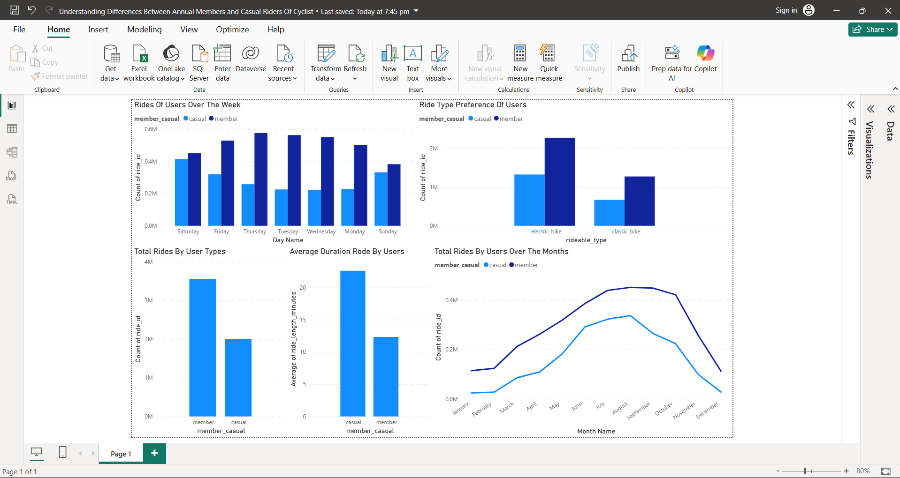

# Cyclistic Bike Share Analysis

## Project Overview

This project analyzes 12 months of Cyclistic bike-share trip data to identify behavioral differences between annual members and casual riders. The goal is to generate data-driven recommendations that can help Cyclistic convert casual riders into annual members.

## Business Problem

Cyclistic wants to increase the number of annual memberships because annual members are more profitable than casual riders.

Business Question:

**How do annual members and casual riders use Cyclistic bikes differently?**

## Tools Used

* Power BI
* Power Query
* DAX

## Data Preparation

The following steps were performed:

* Combined 12 monthly datasets
* Created ride length calculations
* Created day-of-week and month fields
* Removed invalid ride durations
* Cleaned and transformed data using Power Query

## Dashboard

## Key Findings

### 1. Members Generate More Rides

Annual members generated significantly more rides than casual riders.

### 2. Casual Riders Stay Longer

Casual riders recorded longer average ride durations than annual members.

### 3. Different Weekly Usage Patterns

Members showed higher activity during weekdays.

Casual riders demonstrated increased activity during weekends.

### 4. Strong Seasonal Demand

Ridership increased significantly between March and August before gradually declining.

### 5. Electric Bikes Are Preferred

Both casual riders and annual members preferred electric bikes over classic bikes.

## Recommendations

### Recommendation 1

Target weekend casual riders with membership promotions.

### Recommendation 2

Launch membership campaigns before the March-August peak season.

### Recommendation 3

Use digital marketing to highlight the cost savings of annual memberships.

## Conclusion

The analysis revealed clear behavioral differences between annual members and casual riders. Members primarily use Cyclistic for transportation and commuting, while casual riders use the service more for leisure and recreational purposes.

These insights can help Cyclistic design targeted marketing strategies to increase annual membership conversions.
